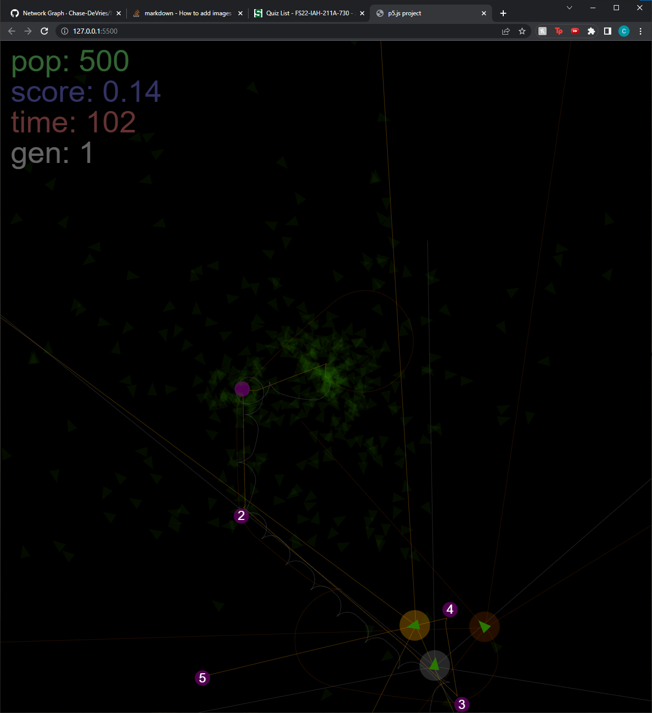
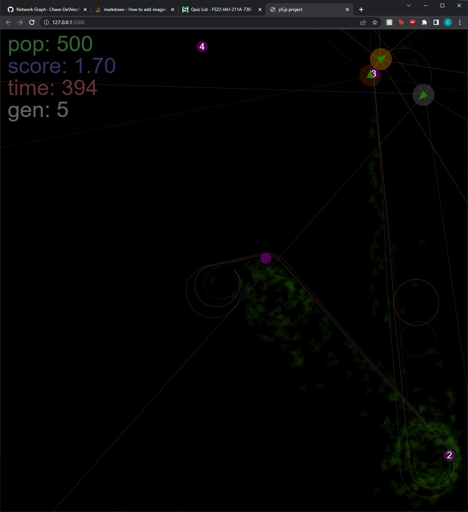
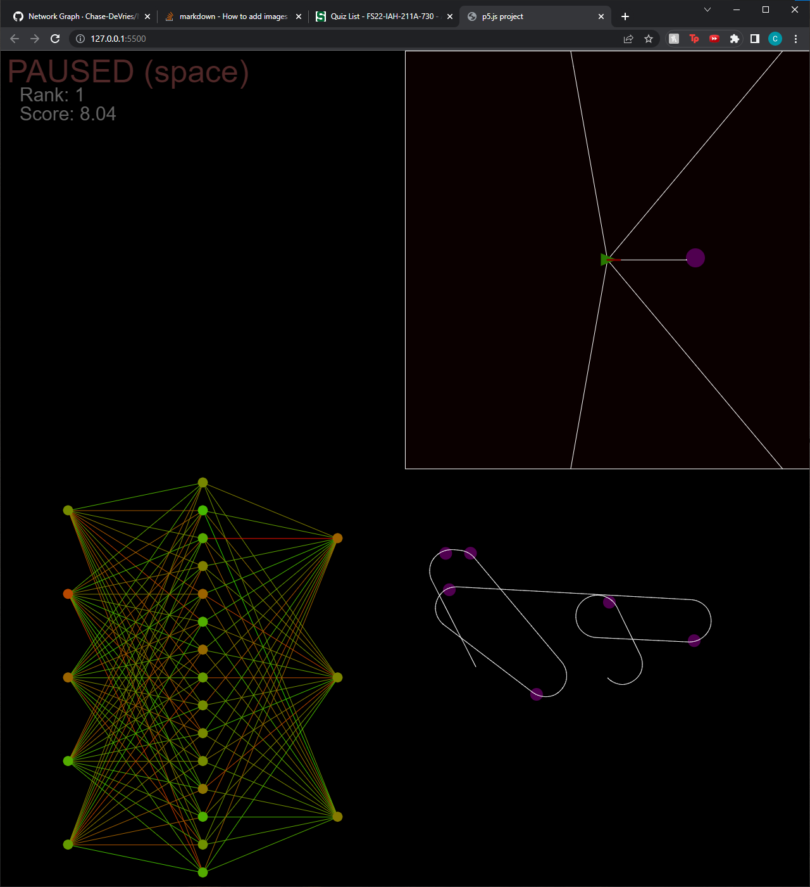

# Neural Network Genetic Algorithm

This is a project that I completed in the summer of 2022. It uses a library called p5, which is used to create the graphic display. The initial comit was carried over from [this project](https://editor.p5js.org/chase.devries@gmail.com/full/jgzhmTut1) that I made in the online p5 editor in 2019. The [Live Server vscode Extension](https://marketplace.visualstudio.com/items?itemName=ritwickdey.LiveServer) is required to run the project in your browser using a live server.

## Getting started
1. Open the project in vscode
2. Install [Live Server vscode Extension](https://marketplace.visualstudio.com/items?itemName=ritwickdey.LiveServer)
3. Using the command pallete use 'Live Server: Open With Live Server', or the 'Go Live' button on the status bar to view the project in a browser.

## What is this project?
I started this project in 2019 as a senior in highschool, and have added to it sporadically ever since. The majority of the work done for this project took place in the summer of 2021. Starting this project with little to no real programming education has put a lot of emphasis on the importance of the skills I have learned during my formal education at Michigan State University. This project is still far from perfect, but has served as a way for me to gain appreciation for various concepts in computer science.

## What does it actually do?
1. When you first launch the application, it starts with a randomly generated population of 'Grazers.' The UI shows the size, average score, remaining frames, and generation number of the current population. The goal of the grazers is to consume the 'Food' in their world. They each must consume the same food in the same order to recieve points. Grazers recieve more points for being the first to consume food on their shared path. The first, second, and third place grazers will be highlighted in gold, silver, and bronze respectively, and their ray-traced vision will be displayed.

2. The genetic algorithm component of this simulation generates a new population after a specified number of frames. Based on the score rank of a grazer, they will have a probability to reproduce (a grazer with a mutated version of their 'brain' will be added to the following generation). The brain of a grazer is represented by a small neural network whose inputs are determined by ray-tracing in search of food, and outputs are turn left, turn right, and move forward. 

3. When the spacebar is pressed the pause menu appears. Using the arrow keys, the user change which grazer they would like to analyze. This menu displays four things:
    1. Top-Left : display the rank and score of the current grazer
    2. Top-Right : an interactive simulation of how this grazer responds to input. When you mouse over this box, the food will follow your mouse, and the grazer's ray tracing will respond to the food. A line will be drawn from the position of the grazer showing how it would move based on this input.
    3. Bottom-Left : a visual representation of the neural network of the selected grazer. The circles represent the bias of each neuron, and the lines represent the weight of each connection. More negative values are shown in red, and more positive values in green.
    4. Bottom-Right : a visual representation of the path taken by this grazer, and the food that it has eaten.
